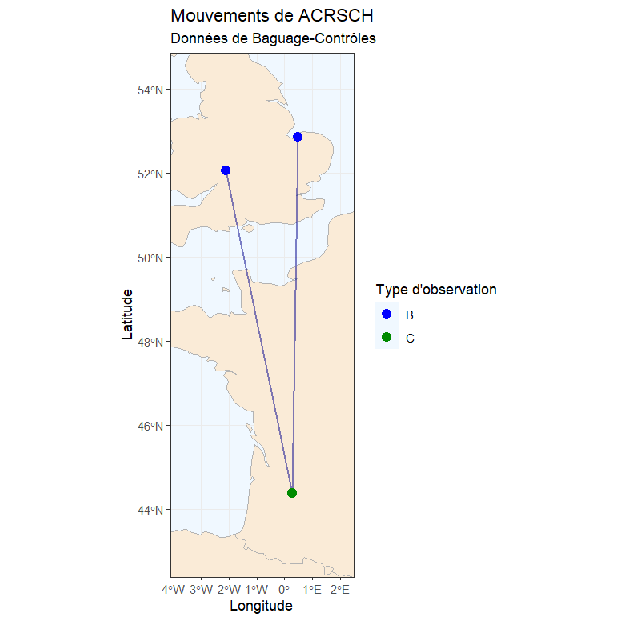

# 🗺️ Cartographie des données de baguage (CRBPO) avec R

Ce dépôt contient les scripts R pour cartographier les déplacements d'oiseaux à partir des données d'export du CRBPO.

**⚠️ NOUVEAUTÉ 2025 :** Une nouvelle méthode basée sur **`ggplot2`** est désormais disponible. Elle est plus esthétique, plus simple et remplace l'ancienne méthode (`birdring`).

## ✨ La nouvelle méthode (Recommandée)

Le code à utiliser est : **`Nouveau (2025) Code carto ggplot2.R`**

### Pourquoi changer ?
* **Automatique :** Gère les Baguages (B), Contrôles (C) et Reprises (R) sans modification manuelle du fichier Excel.
* **Chronologique :** Trie automatiquement les observations par date.
* **Esthétique :** Fonds de carte haute résolution.

### 🚀 Comment l'utiliser ?
1.  Téléchargez le fichier **`Nouveau (2025) Code carto ggplot2.R`**.
2.  Placez-le dans le même dossier que votre fichier de données Excel.
3.  Ouvrez-le dans RStudio.
4.  Installez les nouveaux paquets requis (indiqués en haut du script).
5.  Modifiez le nom du fichier à importer et le code espèce.

---

## 🗄️ Archives (Ancienne méthode)

Les scripts et tutoriels de l'ancienne version (utilisant le package `birdring`) sont toujours disponibles dans ce dépôt pour référence ou pour la compatibilité avec d'anciens projets.

Vous les trouverez sous les noms :
* 📜 **Script R :** `Ancien code (<2024) code_carto.R`
* 📘 **Tutoriel PDF :** `Ancien code (<2024) Tuto cartographier des données BCR.pdf`

*Note : Cette ancienne méthode nécessite des modifications manuelles du fichier Excel (ajout de colonnes) qui ne sont plus nécessaires avec la nouvelle version.*

---

## 📋 Format des données (Pour le nouveau script)

Le nouveau script fonctionne directement avec les exports standards (colonnes nécessaires : BAGUE, ESPECE, DATE, LAT, LON, ACTION).

## 🎨 Légende des couleurs (Nouveau script)
* 🔵 **Bleu** : Baguage (B)
* 🟢 **Vert** : Contrôle (C)
* 🔴 **Rouge** : Reprise (R)
